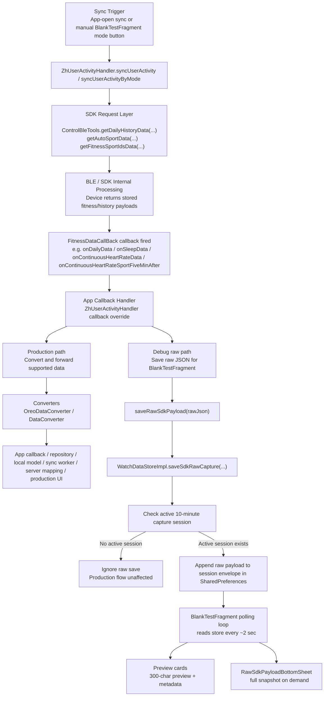

# FitnessDataCallBack, 10-Minute Session, and Complete Flow Diagram

This document explains the exact relationship between:

- normal sync
- `FitnessDataCallBack`
- the new `v2.3.1` raw payload capture
- the 10-minute session
- `BlankTestFragment`

The main confusion usually comes from mixing up:

1. the **real sync/data pipeline**
2. the **debug raw-capture session**

They are related, but they are not the same thing.

---

## 1. The single most important point

**The 10-minute session is not part of how the SDK sync works.**

It is only part of how the app’s **debug raw-capture layer** works for the `BlankTestFragment`.

That means:

- normal sync still happens normally
- `FitnessDataCallBack` still fires normally
- productionized data still flows normally
- the 10-minute session only decides whether the app should save raw callback payloads into the test raw store for debug inspection

So the 10-minute session is a **post-callback debug storage rule**, not a BLE sync rule.

---

## 2. Highest-to-lowest flow

Here is the complete implementation flow from top to bottom.



---

## 3. What happens before the callback

## 3.1 Sync starts

A sync can begin from:

- app-open sync
- manual sync in `BlankTestFragment`
- possibly other normal app sync triggers

For Luna Band specifically:

- the production default sync path now resolves to `getDailyHistoryData(3)` i.e. `ALL`

The sync request goes through:

- `ZhUserActivityHandler.syncUserActivity(...)`
- `ZhUserActivityHandler.syncUserActivityByMode(...)`

Then into:

- `ControlBleTools.getDailyHistoryData(...)`
- plus sport-related requests like `getAutoSportData(...)` and `getFitnessSportIdsData(...)`

## 3.2 SDK receives stored device data

The SDK internally talks to the device over BLE and receives stored historical/fitness data.

This is the actual data retrieval phase.

The 10-minute session is **not involved here**.

At this stage, the SDK simply does its normal work and then fires callbacks.

---

## 4. What happens at the callback layer

Once the SDK has data, it calls methods on `FitnessDataCallBack`, for example:

- `onDailyData`
- `onSleepData`
- `onContinuousHeartRateData`
- `onContinuousPressureData`
- `onSleepRRIData`
- `onSleepHRVData`
- `onContinuousHeartRateSportFiveMinAfter`
- `onContinuousRRIData`

These land inside the app’s implementation in:

- `ZhUserActivityHandler`

This is the crucial split point.

At this point, the app can do two things:

1. production handling
2. debug raw storage

Sometimes it does both.

---

## 5. Production path after `FitnessDataCallBack`

This is the “real app” path.

For callbacks that are already productionized, the app:

1. receives SDK bean
2. converts it
3. forwards it into app callback/repository flow
4. later persists/uploads/shows it in production UI

Examples:

- `onDailyData`
- `onSleepData`
- `onContinuousHeartRateData`
- `onContinuousPressureData`
- some ring-specific callbacks like respiratory, sleep result, day movement, body stress

### Important point

The 10-minute raw session does **not** control this production path.

Even if the raw debug session is absent or expired:

- production conversion still happens
- production callbacks still happen
- sync still works

So if someone asks:

"If the 10-minute session expires, does sync stop working?"

The answer is:

- **No**
- only debug raw saving stops

---

## 6. Debug raw path after `FitnessDataCallBack`

This is the `BlankTestFragment` support path.

For certain callbacks, the handler also does:

1. serialize bean to JSON
2. call `saveRawSdkPayload(...)`
3. which delegates to a raw saver in `WatchDataStore`

For example:

- continuous HR raw
- continuous pressure raw
- sleep RRI raw
- sleep HRV raw
- continuous RRI raw
- post-workout heart-rate raw
- dev sport raw

This is where the 10-minute session becomes relevant.

---

## 7. Exactly where the 10-minute session is checked

The 10-minute session is checked **inside `WatchDataStoreImpl.saveSdkRawCapture(...)`**.

That function does:

1. reject blank payloads
2. read current time
3. read active SDK raw capture session
4. if there is no active session, return immediately
5. if active session exists, append payload into that session envelope

So the real logic is:

```text
callback fired
-> raw JSON created
-> attempt raw save
-> if session active: save
-> if session inactive: ignore raw save
```

This means the session is a **gate around raw debug persistence only**.

It is **not**:

- a gate around callback delivery
- a gate around BLE sync
- a gate around converter execution
- a gate around production server sync

---

## 8. Why this was implemented this way

The app needed a safe way to inspect large new SDK payloads in the test fragment without:

- adding a DB table
- storing huge raw payloads forever
- mixing old test runs with new test runs
- letting debug raw storage grow unbounded

So the app added:

- a session id
- a start time
- an expiry time
- a mode label like `TODAY`, `HISTORY`, `ALL`, `DEFAULT`

This gives us:

- clean session-based capture
- known sync mode for each captured payload
- automatic stop after 10 minutes

It is basically a **debug capture window**, not a sync window.

---

## 9. What happens when there is no active session

If sync happens normally and callbacks fire, but there is no active raw session:

- the raw session-based debug payloads are not appended to the raw envelopes
- `BlankTestFragment` may keep showing old stored session data or “No payload captured yet”
- productionized callbacks still continue as normal

So:

- **callback still happens**
- **production handling can still happen**
- **raw test capture may not happen**

This is the exact reason auto sync and raw debug capture can feel “different.”

---

## 10. What starts the 10-minute session

The 10-minute session is started manually by `BlankTestFragment` when you tap:

- `DEFAULT`
- `TODAY`
- `HISTORY`
- `ALL`

When one of these buttons is pressed, the fragment:

1. creates a new session with start and expiry time
2. clears previous raw session keys for the relevant payloads
3. stores the mode label
4. then triggers sync

So the session is intentionally tied to a manual test run.

That gives each manual sync test:

- its own clean raw capture window
- its own mode label
- its own callback history

---

## 11. What happens after raw payload is saved

Once the payload is saved into the session envelope in SharedPreferences:

1. `BlankTestFragment` polling loop reads it
2. resolves the payload into:
   - total capture count
   - valid capture count
   - latest capture
   - latest valid capture
3. builds metadata summary
4. builds 300-char preview text
5. updates the UI

That polling loop runs every about **2 seconds** while the fragment is open.

So the callback does not directly push text into the screen.

Instead:

- callback updates storage
- UI polling notices the new storage value
- then screen updates

---

## 12. How preview and full raw are related to the session

The preview and bottom sheet both read the same stored raw envelope.

### Preview card

Shows:

- capture count
- valid count
- mode/session label
- latest valid or latest captured timestamp
- first 300 chars only

### Bottom sheet

Shows:

- session label
- mode
- started time
- updated time
- selected payload time
- latest callback time
- full selected payload
- capture log if multiple callbacks arrived

So the session is reflected in the UI through:

- labeling
- freshness information
- payload grouping

---

## 13. How this differs from production implementation

This distinction is critical.

### Production implementation

For productionized callbacks, the flow is:

```text
sync -> callback -> converter -> app model / repository / worker / upload / production UI
```

### Debug implementation

For raw test capture, the flow is:

```text
sync -> callback -> raw JSON -> session gate -> raw store -> debug UI
```

The 10-minute session only exists in the second flow.

It does not exist in the first flow.

---

## 14. Example with continuous heart rate

This example makes it easier to understand.

## 14.1 Normal sync happens

The SDK calls:

- `onContinuousHeartRateData(ContinuousHeartRateBean)`

## 14.2 Production path

The app:

- converts the bean
- normalizes by `frequencyVersion` if needed
- forwards into production heart-rate pipeline

This happens regardless of raw session.

## 14.3 Debug path

The app also:

- serializes raw bean JSON
- tries to save raw capture

If session active:

- raw preview card updates soon

If no session:

- raw preview may not update

So one callback can drive:

- production behavior
- debug behavior

but the 10-minute session only affects the debug half.

---

## 15. Example with post-workout HR after 5 minutes

This example is even more important.

The SDK calls:

- `onContinuousHeartRateSportFiveMinAfter(...)`

In the current app:

- there is no production converter/repository/server/UI path yet
- only raw debug capture exists

So for this callback:

```text
sync -> callback -> raw JSON -> session gate -> raw store -> BlankTestFragment
```

There is no parallel productionized branch yet.

That is why for this particular callback, the 10-minute session feels much more important: it currently controls the only user-visible handling path in the app.

---

## 16. Highest-to-lowest implementation stack

Here is the full layered architecture in plain English.

### Level 1: User / app event

- app opens
- or user presses a manual mode button

### Level 2: Sync orchestration

- `BlankTestFragment` or normal app flow triggers sync
- `ZhUserActivityHandler.syncUserActivity...`

### Level 3: SDK request layer

- `ControlBleTools.getDailyHistoryData(...)`
- `getAutoSportData(...)`
- `getFitnessSportIdsData(...)`

### Level 4: SDK/BLE layer

- BLE fetches stored device data
- SDK parses incoming payloads

### Level 5: `FitnessDataCallBack`

- callback methods fire one by one

### Level 6: App callback implementation

- `ZhUserActivityHandler` receives each callback

### Level 7A: Production path

- converter
- app callback
- repository / DB / sync worker / upload / production screen

### Level 7B: Debug raw path

- serialize bean to raw JSON
- attempt save into `WatchDataStore`

### Level 8B: Session gate

- if active 10-minute session exists -> keep raw capture
- else -> ignore raw debug save

### Level 9B: Debug UI readout

- `BlankTestFragment` polls store every 2 seconds
- `RawSdkPayloadBottomSheet` loads full snapshot on demand

---

## 17. The cleanest mental model

Use this mental model:

### Normal sync path

“Real app data pipeline”

### 10-minute session path

“Temporary debug recording window attached after the callback”

That is the cleanest possible way to think about it.

---

## 18. Best verbal explanation for a senior engineer

If you want to explain it clearly, say:

The 10-minute session is not part of the BLE sync contract or the SDK callback contract. Sync still happens normally and `FitnessDataCallBack` still fires normally. The 10-minute session is only a debug-layer mechanism added in `WatchDataStoreImpl` so that when certain `v2.3.1` callbacks fire, the app can optionally record raw JSON into a temporary capture session for `BlankTestFragment`. So after the callback, there are effectively two branches: the normal production branch for already-supported data, and the debug raw branch for inspection. The session gate exists only on the debug raw branch.

---

## 19. Final takeaway

The exact relevance of the 10-minute session is:

- **before callback**: irrelevant
- **during BLE sync**: irrelevant
- **during callback delivery**: irrelevant
- **after callback, when saving raw debug JSON**: fully relevant
- **for productionized app data flow**: irrelevant
- **for `BlankTestFragment` raw payload visibility**: very relevant

So the shortest final answer is:

**The 10-minute session is a debug raw-capture window that lives after `FitnessDataCallBack`, not inside sync itself.**
