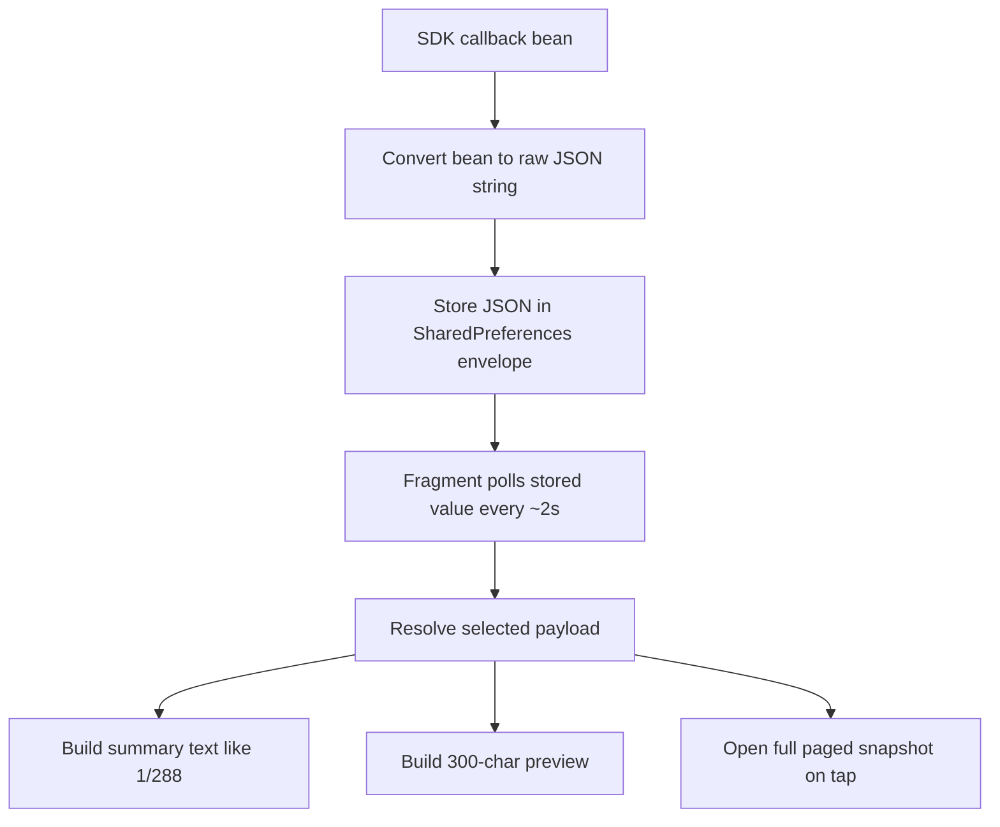

# Continuous Raw Data Validity And Preview Explainer

This document explains how the `BlankTestFragment` raw preview works for the continuous `v2.3.1` payloads, what `valid` means, how `null` and `0` are treated, and what preview labels like `1/288` mean.

## Scope

This document is about the **raw debug viewer path** used in:

- [BlankTestFragment.kt](/Users/amjadimran/Downloads/demo/noisefit-android-luna%20/app/src/main/java/com/oreo/ui/home/summary/BlankTestFragment.kt)
- [RawSdkPayloadBottomSheet.kt](/Users/amjadimran/Downloads/demo/noisefit-android-luna%20/app/src/main/java/com/oreo/ui/home/summary/RawSdkPayloadBottomSheet.kt)
- [WatchDataStoreImpl.kt](/Users/amjadimran/Downloads/demo/noisefit-android-luna%20/commons/src/main/java/com/noisefit_commans/data/local/implementation/WatchDataStoreImpl.kt)

This is different from the **production conversion path** in:

- [OreoDataConverter.kt](/Users/amjadimran/Downloads/demo/noisefit-android-luna%20/noisefit_zh_sdk/src/main/java/com/noisefit_zhsdk/handler/OreoDataConverter.kt)

## Highest-Level Mental Model

For the raw cards in `BlankTestFragment`, the app does this:

## How Raw Data Is Stored

The raw callbacks are saved as JSON strings.

`ZhUserActivityHandler` receives the SDK bean, serializes it with `Gson().toJson(...)`, and stores it through `WatchDataStore`.

During an active raw capture session, the stored value is not just a single payload. It becomes an envelope containing:

- `sessionId`
- `startedAt`
- `updatedAt`
- `mode`
- `label`
- `captures[]`

Each item in `captures[]` contains:

- `capturedAt`
- `payload`

Relevant code:

- [ZhUserActivityHandler.kt](/Users/amjadimran/Downloads/demo/noisefit-android-luna%20/noisefit_zh_sdk/src/main/java/com/noisefit_zhsdk/handler/ZhUserActivityHandler.kt)
- [WatchDataStoreImpl.kt:187](/Users/amjadimran/Downloads/demo/noisefit-android-luna%20/commons/src/main/java/com/noisefit_commans/data/local/implementation/WatchDataStoreImpl.kt#L187)
- [WatchDataStoreImpl.kt:252](/Users/amjadimran/Downloads/demo/noisefit-android-luna%20/commons/src/main/java/com/noisefit_commans/data/local/implementation/WatchDataStoreImpl.kt#L252)

## How The UI Chooses Which Payload To Show

The UI does **not** always show the literal last callback.

It first resolves all captures in the session, then:

1. parses each payload to `JsonObject`
2. checks whether each payload is `valid`
3. chooses the **latest valid payload**
4. if none are valid, falls back to the **latest captured payload**

Relevant code:

- [RawSdkPayloadBottomSheet.kt:61](/Users/amjadimran/Downloads/demo/noisefit-android-luna%20/app/src/main/java/com/oreo/ui/home/summary/RawSdkPayloadBottomSheet.kt#L61)

This is why the preview can say:

- `Showing latest valid payload`
- or `Showing latest captured payload`

That behavior exists because the newest callback can sometimes be zero-only or empty-like, and showing the previous meaningful callback is more useful for debugging.

## What `valid data` Means

`valid` here does **not** mean medically correct, backend-synced, or production-persisted.

It only means:

**the selected raw JSON contains meaningful non-empty data in the expected payload arrays**

Validity is payload-specific:

- continuous heart rate: `heartRateData`
- continuous pressure: `pressureData` or `rriData`
- sleep RRI: `rri`
- sleep HRV: `hrv`
- continuous RRI: `rri`
- post-workout HR: nested `hrList[*].heartRate`

Relevant code:

- [RawSdkPayloadBottomSheet.kt:314](/Users/amjadimran/Downloads/demo/noisefit-android-luna%20/app/src/main/java/com/oreo/ui/home/summary/RawSdkPayloadBottomSheet.kt#L314)

## How `null`, Empty, And `0` Are Handled

This is the most important distinction.

### In the raw preview path

For preview validity, the app treats values like this:

- `null` -> not meaningful
- missing field -> not meaningful
- empty array -> not meaningful
- blank string -> not meaningful
- `false` -> not meaningful
- numeric `0` -> not meaningful
- non-zero number -> meaningful

Relevant code:

- [RawSdkPayloadBottomSheet.kt:450](/Users/amjadimran/Downloads/demo/noisefit-android-luna%20/app/src/main/java/com/oreo/ui/home/summary/RawSdkPayloadBottomSheet.kt#L450)

So if a raw JSON has:

- `heartRateData: null`
- or `heartRateData: []`
- or `heartRateData: [0,0,0,...]`

then that payload is treated as **not valid / zero-only** for preview selection.

### Does `null` get displayed as `0`?

Not directly.

The app does **not** rewrite `null` into a literal JSON `0` in the raw viewer.

Instead:

- count helpers return size `0` for missing or non-array fields
- meaningful counts return `0`
- summary text may show `0/0`, `0/288`, or `No payload captured yet.`

So the raw UI behavior is:

- missing payload -> `No payload captured yet.`
- missing list field -> count becomes `0`
- zero-only list -> total count is present, valid count becomes `0`

### In the production normalization path

This is different.

For continuous HR / pressure conversion, the app may normalize higher-frequency source samples into 5-minute legacy buckets. During that averaging, a bucket with no meaningful values becomes `0`.

Relevant code:

- [OreoDataConverter.kt:1222](/Users/amjadimran/Downloads/demo/noisefit-android-luna%20/noisefit_zh_sdk/src/main/java/com/noisefit_zhsdk/handler/OreoDataConverter.kt#L1222)

That means:

- raw preview path: `null` is not converted into a visible `0`
- production normalized path: an empty/invalid bucket may become numeric `0`

## What Preview Text Like `1/288` Means

The preview meta line is a compact summary of the **selected payload**.

### Example 1

`2026-04-09 | heartRateData 1/288 | captures 1/2 valid | every 30 seconds`

Meaning:

- `2026-04-09`
  - the payload date field
- `heartRateData 1/288`
  - out of 288 total entries in `heartRateData`, only 1 is meaningful
- `captures 1/2 valid`
  - this session captured 2 callbacks total, and 1 of them counted as valid
- `every 30 seconds`
  - the payload says the source cadence is every 30 seconds

### Example 2

`2026-04-09 | pressureData 5/288 | rriData 4/288 | captures 1/3 valid | every 30 seconds`

Meaning:

- `pressureData 5/288`
  - 5 meaningful pressure samples out of 288 slots
- `rriData 4/288`
  - 4 meaningful RRI samples out of 288 slots

### Example 3

`2026-04-09 | rri 0/288 | captures 0/2 valid`

Meaning:

- the payload exists
- there are 288 positions in the array
- none of them are meaningful according to preview logic
- so the session has not yet produced a useful payload for that type

### Example 4

`2026-04-09 | hrList 2 segments | heartRate 1/6 | captures 1/2 valid`

For post-workout HR this means:

- `hrList 2 segments`
  - there are 2 time segments in `hrList`
- `heartRate 1/6`
  - inside those segments, there are 6 nested HR samples total, and 1 is meaningful

Relevant code:

- [RawSdkPayloadBottomSheet.kt:157](/Users/amjadimran/Downloads/demo/noisefit-android-luna%20/app/src/main/java/com/oreo/ui/home/summary/RawSdkPayloadBottomSheet.kt#L157)
- [RawSdkPayloadBottomSheet.kt:192](/Users/amjadimran/Downloads/demo/noisefit-android-luna%20/app/src/main/java/com/oreo/ui/home/summary/RawSdkPayloadBottomSheet.kt#L192)

## What Gets Rendered On The Main UI

The main fragment does **not** render the full payload inline.

It renders:

- summary metadata
- capture count
- valid count
- selected payload type
- selection label
- only the first `300` characters of the chosen raw JSON

Relevant code:

- [BlankTestFragment.kt:62](/Users/amjadimran/Downloads/demo/noisefit-android-luna%20/app/src/main/java/com/oreo/ui/home/summary/BlankTestFragment.kt#L62)
- [BlankTestFragment.kt:515](/Users/amjadimran/Downloads/demo/noisefit-android-luna%20/app/src/main/java/com/oreo/ui/home/summary/BlankTestFragment.kt#L515)

That is why the fragment can safely show very large raw payloads without dumping the entire JSON into a `TextView`.

## What Gets Rendered On Demand

When you tap a raw card, the app opens `RawSdkPayloadBottomSheet`.

That bottom sheet renders:

- session information
- selected payload timestamp
- latest callback timestamp
- pretty-printed selected payload
- full capture log
- paged content, about `3500` chars per page

Relevant code:

- [RawSdkPayloadBottomSheet.kt:474](/Users/amjadimran/Downloads/demo/noisefit-android-luna%20/app/src/main/java/com/oreo/ui/home/summary/RawSdkPayloadBottomSheet.kt#L474)

So the design is:

- main UI = lightweight preview
- tap = full raw inspection

## How Often The Preview Refreshes

`BlankTestFragment` polls the stored values in a coroutine loop and refreshes the cards every about 2 seconds while the fragment is alive.

Relevant code:

- [BlankTestFragment.kt:609](/Users/amjadimran/Downloads/demo/noisefit-android-luna%20/app/src/main/java/com/oreo/ui/home/summary/BlankTestFragment.kt#L609)

This means the preview updates automatically from local storage, but only based on what has already been saved.

## Practical Answers You Can Give In Review

### If asked: "Will null data show as 0?"

Say:

For the raw debug viewer, no. `null`, missing arrays, and `0` values are treated as non-meaningful. The UI either shows no payload, or shows counts like `0/288`. Only in the production normalization path can an empty bucket be collapsed into numeric `0`.

### If asked: "What is valid data?"

Say:

`valid` in the test fragment only means the payload has meaningful non-zero content in the expected array fields for that callback type. It is a debug selection rule, not a medical-quality or backend-success flag.

### If asked: "What does 1/288 mean?"

Say:

It means one meaningful sample was found out of 288 total positions in that selected raw payload array.

