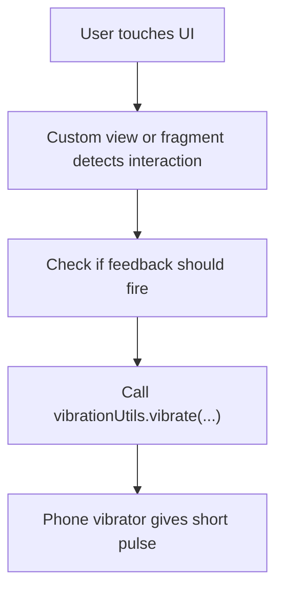

# Haptics Implementation Explainer

This document explains how haptics are implemented in the app, how they differ from watch-side vibration settings, and what is currently wired versus only present as data-layer plumbing.

## Short Answer

There are two different haptics concepts in this codebase:

1. **Phone-side UI haptics**
   - the Android phone vibrates during app interactions
2. **Watch-side vibration settings**
   - the app has query/update contracts for watch vibration intensity, but the current ZH query callback handling is not fully wired through to app usage

These two should not be mixed up.

## Layer 1: Phone-Side UI Haptics

The main app haptic helper is `VibrationUtils`.

Relevant code:

- [VibrationUtils.kt](/Users/amjadimran/Downloads/demo/noisefit-android-luna%20/commons/src/main/java/com/noisefit_commans/utils/VibrationUtils.kt)
- [UtilsModule.kt](/Users/amjadimran/Downloads/demo/noisefit-android-luna%20/app/src/main/java/com/noisefit/di/UtilsModule.kt)

### What `VibrationUtils` Does

It obtains Android's `Vibrator` service from application context and exposes:

- `vibrate(value: Long)`
- `cancelVibrate()`

Constants:

- `LOW_VIBRATION = 200L`
- `HAPTIC_VIBRATION = 60L`

Behavior:

- on Android O+ it uses `VibrationEffect.createOneShot`
- on older Android it uses legacy `vibrate(value)`

So this is standard **phone vibration**, not a watch BLE command.

## How Phone Haptics Are Injected

`VibrationUtils` is provided as a singleton by Hilt:

- [UtilsModule.kt:21](/Users/amjadimran/Downloads/demo/noisefit-android-luna%20/app/src/main/java/com/noisefit/di/UtilsModule.kt#L21)

That lets fragments, view models, and custom views use the same helper.

## Where Phone Haptics Are Used

Phone haptics are used widely for UI feedback.

Examples found in the project:

- chart interactions
- onboarding / pairing states
- sleep planner interactions
- home summary interactions
- service stop feedback

### Example: Heart Rate Chart

In the heart-rate chart:

- entering long-press interactive mode vibrates
- moving onto a non-zero selected value vibrates

Relevant code:

- [HeartRateChartView.kt:509](/Users/amjadimran/Downloads/demo/noisefit-android-luna%20/app/src/main/java/com/oreo/ui/custom/HeartRateChartView.kt#L509)

Important behavior:

- if selected value is `0`, it does not vibrate
- if the chart enters interaction mode, it gives a short haptic pulse

So haptics are being used as **touch feedback**, not as health-data processing.

### Example: Sleep Graph

The sleep graph also injects `VibrationUtils` and triggers `HAPTIC_VIBRATION` during interaction.

Relevant code:

- [SleepGraphViewOreo.kt:1048](/Users/amjadimran/Downloads/demo/noisefit-android-luna%20/commons/src/main/java/com/noisefit_commans/ui/custom/SleepGraphViewOreo.kt#L1048)

### Example: Onboarding / Pairing

Some setup and pairing flows use `LOW_VIBRATION` for stronger feedback.

Relevant code:

- [SettingUpDeviceFragment.kt:127](/Users/amjadimran/Downloads/demo/noisefit-android-luna%20/app/src/main/java/com/noisefit/ui/onboarding/setup/SettingUpDeviceFragment.kt#L127)
- [PairingFragment.kt:241](/Users/amjadimran/Downloads/demo/noisefit-android-luna%20/app/src/main/java/com/noisefit/ui/onboarding/pairing/pair/PairingFragment.kt#L241)

## Phone Haptics Design Pattern

The common pattern is:

The important point is:

**this is local Android feedback only**

It does not travel through BLE to the wearable.

## Layer 2: Watch-Side Vibration Intensity Contracts

The codebase also contains a watch vibration intensity model:

- `Weak`
- `Medium`
- `Strong`

Relevant code:

- [ColorfitData.kt:1083](/Users/amjadimran/Downloads/demo/noisefit-android-luna%20/commons/src/main/java/com/noisefit_commans/models/ColorfitData.kt#L1083)
- [AppStaticData.kt:144](/Users/amjadimran/Downloads/demo/noisefit-android-luna%20/app/src/main/java/com/noisefit/data/local/AppStaticData.kt#L144)

And contracts for:

- querying current watch vibration intensity
- updating watch vibration intensity

Relevant code:

- [QueryAction.kt](/Users/amjadimran/Downloads/demo/noisefit-android-luna%20/commons/src/main/java/com/noisefit_commans/interfaces/QueryAction.kt)
- [UpdateDeviceAction.kt](/Users/amjadimran/Downloads/demo/noisefit-android-luna%20/commons/src/main/java/com/noisefit_commans/interfaces/device_data/UpdateDeviceAction.kt)
- [QueryCallback.kt:36](/Users/amjadimran/Downloads/demo/noisefit-android-luna%20/commons/src/main/java/com/noisefit_commans/interfaces/QueryCallback.kt#L36)
- [UpdateDeviceDataCallback.kt:52](/Users/amjadimran/Downloads/demo/noisefit-android-luna%20/commons/src/main/java/com/noisefit_commans/interfaces/device_data/UpdateDeviceDataCallback.kt#L52)

## How Watch-Side Vibration Requests Are Routed

`ServiceUtil` routes these actions to the correct device-action interface.

Relevant code:

- [ServiceUtil.kt:174](/Users/amjadimran/Downloads/demo/noisefit-android-luna%20/commons/src/main/java/com/noisefit_commans/utils/ServiceUtil.kt#L174)
- [ServiceUtil.kt:227](/Users/amjadimran/Downloads/demo/noisefit-android-luna%20/commons/src/main/java/com/noisefit_commans/utils/ServiceUtil.kt#L227)

So the data-layer intent exists:

- `GetVibrationIntensity`
- `SetVibrationIntensity`

## Important Current-State Detail

In the ZH query handler, the vibration result callback is currently effectively empty:

- `onVibrationResult(model: Int) { }`
- `onVibrationDurationResult(...) { }`

Relevant code:

- [ZhQueryDeviceUnitsHandler.kt:761](/Users/amjadimran/Downloads/demo/noisefit-android-luna%20/noisefit_zh_sdk/src/main/java/com/noisefit_zhsdk/handler/ZhQueryDeviceUnitsHandler.kt#L761)

Also, a repository-wide search in app UI code did not show active app-side usages of:

- `SetVibrationIntensity`
- `GetVibrationIntensity`
- `VibrationIntensityObtained`
- `VibrationIntensityUpdated`

So the safest conclusion is:

**phone-side haptics are clearly implemented and actively used; watch-side vibration intensity has contracts and routing, but its app-facing flow is not clearly production-wired in the current code snapshot.**

## What This Means In Practice

### Clearly implemented

- app chart haptics
- touch feedback haptics
- some pairing/setup/service feedback vibrations

### Present as plumbing, but not clearly completed in UI flow

- watch vibration intensity query result handling
- watch vibration intensity update usage in app screens

## Relation To Alerts / Watch Native Haptics

Some wearable alert behavior is device-native.

That means:

- the watch itself may vibrate for its own alerts or alarms
- the app does not need to produce a phone haptic every time the watch vibrates

So when discussing haptics with a senior engineer, separate:

1. phone feedback haptics
2. watch-native alert vibration behavior
3. watch vibration intensity settings plumbing

Those are related, but not the same implementation.

## Practical Answers You Can Give In Review

### If asked: "How are haptics implemented?"

Say:

The app uses a shared `VibrationUtils` helper for phone-side haptic feedback, mostly for interactive charts and UI actions. It gives short one-shot Android vibrator pulses, typically `60ms` for touch feedback and `200ms` for stronger state feedback.

### If asked: "Is this the same as watch vibration?"

Say:

No. Phone haptics are local Android vibrations. Watch vibration intensity has separate query/update contracts in the device settings layer.

### If asked: "Is watch-side vibration intensity fully wired?"

Say:

The contracts and routing exist, but in the current ZH query handler the vibration result callback is still effectively empty, and I did not find clear app-screen usage of the vibration intensity callbacks in this code snapshot.

