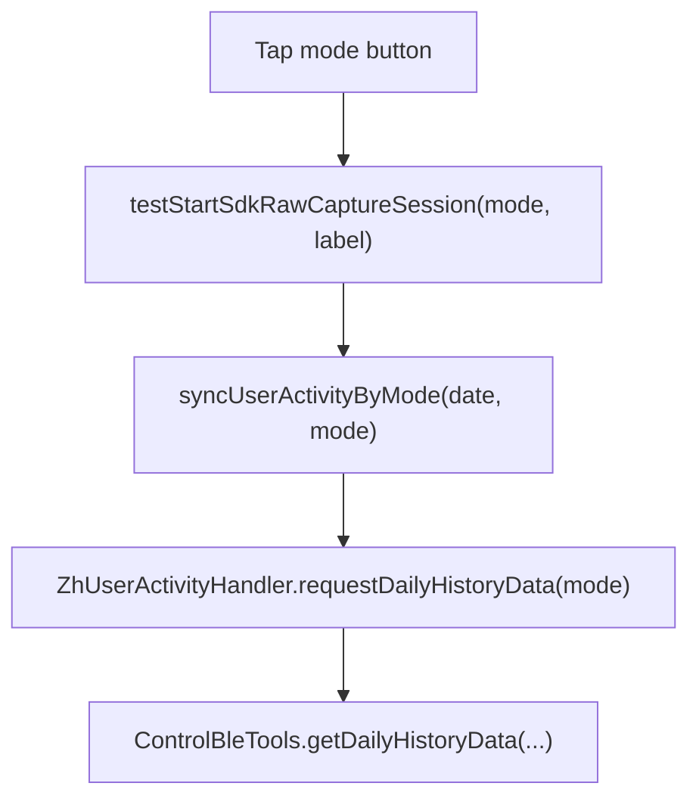

# SDK Sync Modes Effects Explainer

This document explains what the sync mode buttons do, what they do **not** do, and how they affect the raw `v2.3.1` payload cards in `BlankTestFragment`.

## Short Answer

The mode buttons affect the **sync request scope** and the **raw capture session label**.

They do **not** change:

- JSON parsing logic
- validity rules
- preview rendering logic
- payload selection logic
- data conversion rules

So the mode changes **what the SDK may return**, not **how the app interprets the returned payload**.

## The Four Buttons

There are actually four sync controls on `BlankTestFragment`:

- `DEFAULT`
- `TODAY`
- `HISTORY`
- `ALL`

Relevant code:

- [BlankTestFragment.kt:456](/Users/amjadimran/Downloads/demo/noisefit-android-luna%20/app/src/main/java/com/oreo/ui/home/summary/BlankTestFragment.kt#L456)

## What Each Button Sends

The button press path is:

### `DEFAULT`

Sends:

- `syncUserActivityByMode(date, null)`
- then `getDailyHistoryData(null)`

This is the legacy no-mode request path.

Relevant code:

- [BlankTestFragment.kt:458](/Users/amjadimran/Downloads/demo/noisefit-android-luna%20/app/src/main/java/com/oreo/ui/home/summary/BlankTestFragment.kt#L458)
- [ZhUserActivityHandler.kt:356](/Users/amjadimran/Downloads/demo/noisefit-android-luna%20/noisefit_zh_sdk/src/main/java/com/noisefit_zhsdk/handler/ZhUserActivityHandler.kt#L356)

### `TODAY`

Sends:

- mode `1`
- then `getDailyHistoryData(1, null)`

### `HISTORY`

Sends:

- mode `2`
- then `getDailyHistoryData(2, null)`

### `ALL`

Sends:

- mode `3`
- then `getDailyHistoryData(3, null)`

Relevant code:

- [ZhUserActivityHandler.kt:348](/Users/amjadimran/Downloads/demo/noisefit-android-luna%20/noisefit_zh_sdk/src/main/java/com/noisefit_zhsdk/handler/ZhUserActivityHandler.kt#L348)
- [ZhUserActivityHandler.kt:364](/Users/amjadimran/Downloads/demo/noisefit-android-luna%20/noisefit_zh_sdk/src/main/java/com/noisefit_zhsdk/handler/ZhUserActivityHandler.kt#L364)

## What The Modes Change In Practice

The modes can change:

- how much date scope the SDK fetches
- which stored historical blocks the band returns
- how many callbacks arrive
- which payload becomes the latest valid one
- how many captures are stored in the current test session

The modes do not change:

- field names like `heartRateData`, `pressureData`, `rri`, `hrv`, `hrList`
- the meaning of `valid`
- whether `0` counts as meaningful
- whether preview length is `300`
- how the bottom sheet paginates

## Do The Modes Change The Raw Continuous Data Structure?

No, not in the app-side implementation.

For example, continuous HR is still handled as the same payload type:

- `continuousHeartRateFrequency`
- `frequencyVersion`
- `heartRateData`

Continuous pressure is still handled as:

- `pressureFrequency`
- `frequencyVersion`
- `pressureData`
- `rriData`

So the app assumes the **same schema** for the callback type regardless of mode.

If a mode changes anything, it changes:

- whether data is returned
- how much is returned
- which dates are returned

It does not change the parser branch in `BlankTestFragment` or `RawSdkPayloadBottomSheet`.

## Why The User Feeling Was Correct

Your guess was mostly right for the raw continuous cards.

The buttons do **not** change the preview math or validity logic for those raw continuous payloads.

But they still matter because they can change the **callback supply** coming from the SDK.

So the correct senior-facing explanation is:

**Modes do not change app-side interpretation of continuous raw payloads. They change the sync request scope, which can change what data the SDK returns into those same payload structures.**

## How Modes Interact With The 10-Minute Session

Every manual button press starts a new raw capture session.

That does two things:

1. clears previous raw capture envelopes
2. labels the new session with the selected mode

Relevant code:

- [WatchDataStoreImpl.kt:187](/Users/amjadimran/Downloads/demo/noisefit-android-luna%20/commons/src/main/java/com/noisefit_commans/data/local/implementation/WatchDataStoreImpl.kt#L187)

This does **not** change BLE sync behavior itself. It only makes the raw debug results easier to compare by mode.

## What Happens On Auto Sync

When `BlankTestFragment` opens, it calls:

- `syncUserActivity(today, true)`

Relevant code:

- [BlankTestFragment.kt:82](/Users/amjadimran/Downloads/demo/noisefit-android-luna%20/app/src/main/java/com/oreo/ui/home/summary/BlankTestFragment.kt#L82)

In `ZhUserActivityHandler`, the default production sync path resolves like this:

- for `LUNA_BAND` -> mode `ALL`
- for others -> `null`

Relevant code:

- [ZhUserActivityHandler.kt:340](/Users/amjadimran/Downloads/demo/noisefit-android-luna%20/noisefit_zh_sdk/src/main/java/com/noisefit_zhsdk/handler/ZhUserActivityHandler.kt#L340)
- [ZhUserActivityHandler.kt:805](/Users/amjadimran/Downloads/demo/noisefit-android-luna%20/noisefit_zh_sdk/src/main/java/com/noisefit_zhsdk/handler/ZhUserActivityHandler.kt#L805)

Important detail:

The auto-open sync does **not** start a new raw capture session.

So:

- production sync still runs
- callbacks can still happen
- but the special raw capture envelopes are mainly refreshed by manual mode buttons

## Why You May See Different Results Between Modes

You may see differences such as:

- `TODAY` returns fewer callbacks
- `HISTORY` returns older data only
- `ALL` returns both current and historical blocks
- `DEFAULT` may behave differently because it uses the older no-mode request

But those are **SDK response differences**, not app parsing differences.

## What The Mode Label On UI Means

In preview and bottom sheet, the mode label is just session metadata:

- `DEFAULT`
- `TODAY`
- `HISTORY`
- `ALL`

It tells you which manual capture session produced those raw payloads.

It does not mean the JSON itself is in a different format.

## Practical Answers You Can Give In Review

### If asked: "Do the three mode buttons affect raw continuous parsing?"

Say:

No. Parsing, validity detection, preview summaries, and rendering remain the same. The mode only changes the SDK fetch scope, which can change what callbacks arrive.

### If asked: "Do the modes change data structure?"

Say:

No app-side schema change is applied per mode. The same callback type is parsed the same way in all modes.

### If asked: "Why keep the modes then?"

Say:

Because they are useful for controlled testing. They let us compare what the SDK returns for today-only, history-only, all-data, and legacy no-mode requests while keeping the same viewer logic.

